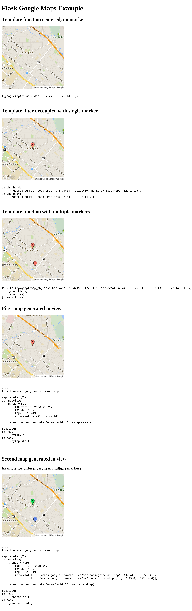

# Flask Google Maps

Easy to use Google Maps in your Flask application

### requires
- Jinja
- Flask
- A google api key (optional I guess)


### Installation

```pip install flask-googlemaps```

or

```bash
git clone https://github.com/rochacbruno/Flask-GoogleMaps
cd Flask-GoogleMaps
python setup.py install
```


### How it works

Flask-GoogleMaps includes some global functions and template filters in your Jinja environment, also it allows you to use the Map in views if needed.


#### registering

in your app

```python
from flask import Flask
from flask.ext.googlemaps import GoogleMaps

app = Flask(__name__)
GoogleMaps(app)
```

In template

```html
{{googlemap("my_awesome_map", lat=0.23234234, lng=-0.234234234, markers=[(0.12, -0.45345), ...])}}
```

That's it! now you have some template filters and functions to use, more details in examples and screenshot below.


### Usage

- You can create the map in the view and then send to the template context
- you can use the template functions and filters directly


#### 1. View

```python
from flask import Flask, render_template
from flask.ext.googlemaps import GoogleMaps
from flask.ext.googlemaps import Map

app = Flask(__name__, template_folder=".")
GoogleMaps(app)

@app.route("/")
def mapview():
    # creating a map in the view
    mymap = Map(
        identifier="view-side",
        lat=37.4419,
        lng=-122.1419,
        markers=[(37.4419, -122.1419)]
    )
    return render_template('example.html', mymap=mymap)

if __name__ == "__main__":
    app.run(debug=True)
```

##### `Map()` Parameters:

- **lat**: The latitude coordinate for centering the map.
- **lng**: The longitutde coordinate for centering the map.
- **zoom**: The zoom level. Defaults to `13`.
- **maptype**: The map type - `ROADMAP`, `SATELLITE`, `HYBRID`, `TERRAIN`. Defaults to `ROADMAP`.
- **markers**: Markers array. Defaults to `None`.
- **varname**: The instance variable name.
- **style**: A string containing CSS styles. Defaults to `"height:300px;width:300px;margin:0;"`.
- **identifier**: The CSS ID selector name.
- **cls**: The CSS Class selector name. Defaults to `"map"`.

#### 2. Template

```html
<!DOCTYPE html>
    <html>
    <head>
            {{"decoupled-map"|googlemap_js(37.4419, -122.1419, markers=[(37.4419, -122.1419)])}}
            {{mymap.js}}
    </head>
    <body>
        <h1>Flask Google Maps Example</h1>

        <h2> Template function centered, no marker </h2>
        {{googlemap("simple-map", 37.4419, -122.1419)}}

        <h2> Template filter decoupled with single marker </h2>
        {{"decoupled-map"|googlemap_html(37.4419, -122.1419)}}


        <h2> Template function with multiple markers </h2>
        
            {{map.html}}
            {{map.js}}
        

        <h2> Generated in view</h2>
        {{mymap.html}}
    </body>
</html>

```

### Screenshot




### TODO:

Implement other methods from the api, add layers etc...


[](https://bitdeli.com/free "Bitdeli Badge")

